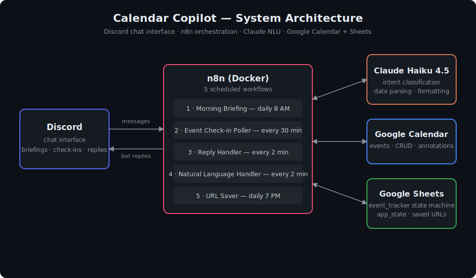
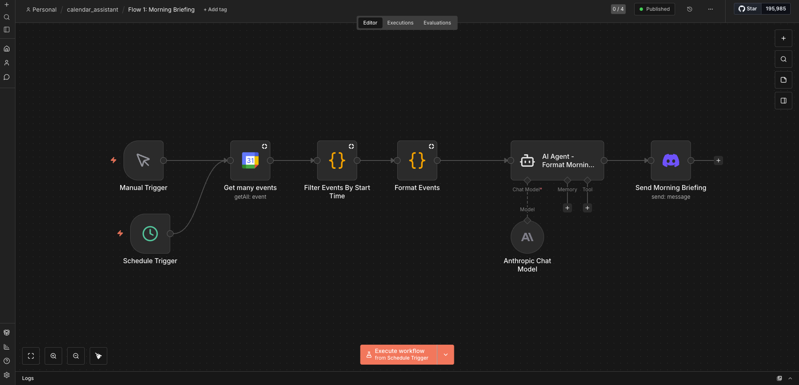
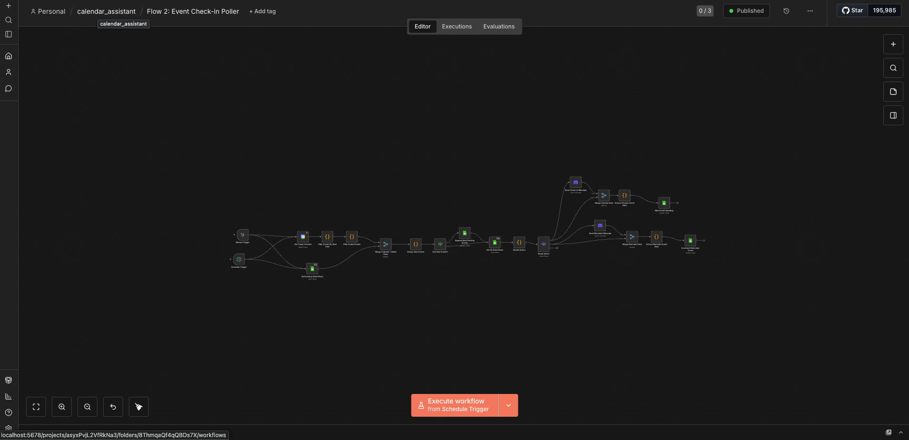
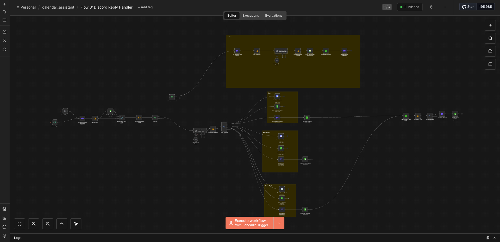
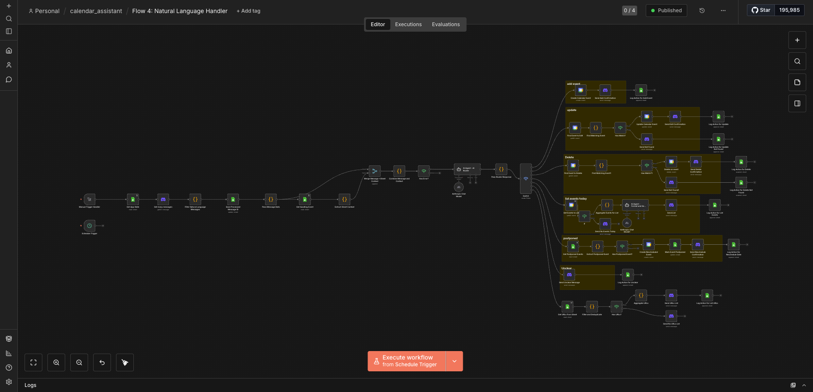
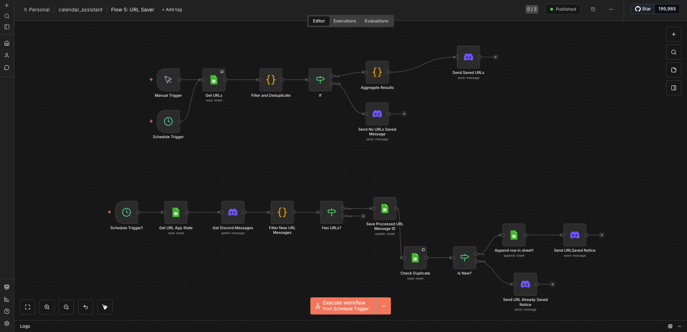
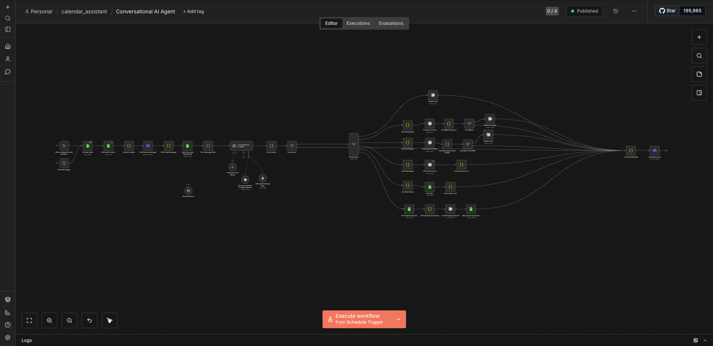

# 📅 Calendar Copilot

**A conversational calendar assistant that lives in Discord** — built with n8n, Claude, Google Calendar, and Google Sheets.

Talk to your calendar in plain English. Get a morning briefing every day. And when an event ends, the bot actually checks in and asks: *did you do it?*

This was my first n8n project — five workflows that work together as one stateful assistant.



## ✨ What it does

- 🌅 **Morning briefing** — every day at 8 AM, the bot posts a friendly summary of today's calendar events to Discord, formatted by Claude.
- ✅ **Accountability check-ins** — when a calendar event ends, the bot notices and asks whether you completed it. Reply `done`, `postpone`, or `cancel`. If you ignore it, it reminds you (and keeps count).
- 💬 **Natural language calendar control** — just type what you want:
  - *"add study tomorrow 3pm for 2 hours"*
  - *"move study to 4pm"*
  - *"delete study"*
  - *"what do I have on Friday?"*
- ⏩ **Smart rescheduling** — postpone an event and tell it *"tomorrow 3pm"*; Claude parses the date and a new calendar event is created automatically.
- 🔗 **URL saver** — drop any link in the channel and it gets captured to a spreadsheet, with a daily 7 PM digest of everything you saved.

## 🧠 How it works

The system is five n8n workflows sharing state through Google Sheets:

### Flow 1 — Morning Briefing
Schedule trigger (8 AM) → fetch today's Google Calendar events → Claude formats them into a friendly briefing → post to Discord.



### Flow 2 — Event Check-in Poller
Every 30 minutes (waking hours only, 7 AM–11 PM): finds calendar events that just **ended**, dedupes them against an `event_tracker` sheet, and sends a Discord check-in. Events that are still unanswered get escalating reminders with a reminder counter.



### Flow 3 — Discord Reply Handler
Every 2 minutes: reads recent Discord messages, and when you reply to a check-in, Claude classifies the intent (`done` / `postpone` / `cancel`). The bot then annotates the original calendar event (✅ / ⏩ / ❌), updates the tracker sheet, and — if you postponed — starts a conversation to reschedule.



### Flow 4 — Natural Language Handler
Every 2 minutes: any free-form message (that isn't a keyword reply or a URL) goes to a Claude-powered router that classifies it into `add_event`, `edit_event`, `delete_event`, `list_events`, `reschedule_date`, or `unclear` — extracting titles, dates, and durations — then performs the calendar operation and confirms in Discord. Processed message IDs are stored in an `app_state` sheet so nothing is handled twice.



### Flow 5 — URL Saver
Daily at 7 PM: scans the day's messages for links, appends them to a sheet, and posts a digest of everything you saved.



### Bonus — Conversational AI Agent
A later iteration that consolidates the message handling into a single agent workflow: one entry point reads Discord messages, routes through an AI agent with memory, and fans out to every action branch (create / update / delete / list events, save URLs, reschedule postponed events).



## 🗂 State machine

Each tracked event moves through a simple lifecycle stored in Google Sheets:

```
pending ──▶ awaiting ──▶ done
                │
                ├──▶ postpone_pending ──▶ postponed  (+ new calendar event)
                │
                └──▶ cancelled
```

Google Sheets acts as the database: an `event_tracker` tab for the check-in state machine, an `app_state` tab for deduplication, and a tab for saved URLs.

## 🛠 Stack

| Piece | Role |
|---|---|
| [n8n](https://n8n.io) (self-hosted, Docker) | Workflow orchestration & scheduling |
| Claude Haiku 4.5 (Anthropic API) | Intent classification, date parsing, message formatting |
| Discord bot | Chat interface |
| Google Calendar API | Event source & CRUD target |
| Google Sheets API | Lightweight state store |

## 📝 Notes

- All schedules respect waking hours (7 AM–11 PM PT) so the bot never pings at 3 AM.
- The workflow definitions aren't published here — this repo documents the design and behavior.
- Built as a learning project; there's plenty I'd do differently now (webhooks instead of polling, a real database instead of Sheets — but Sheets made the state inspectable while learning, which was the point).
